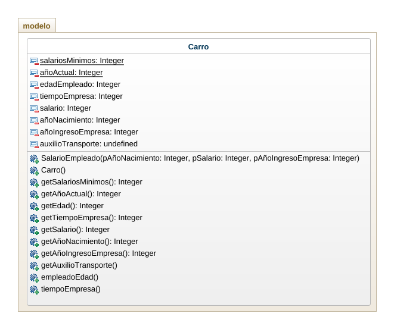

# Caso De Estudio
Una empresa desea conocer el total a pagar por conceptos de salarios a sus empleados. Cada empleado trabaja un número de horas mensuales y recibe una valoración por esa hora de trabajo Si el empleado gana menos de dos salarios mínimos, entonces recibe un auxilio de transporte. Adicionalmente, se desea calcular la edad del empleado, a partir de su fecha de nacimiento y la antigüedad del empleado utilizando su fecha de ingreso a la empresa.

## Diagrama de clases
